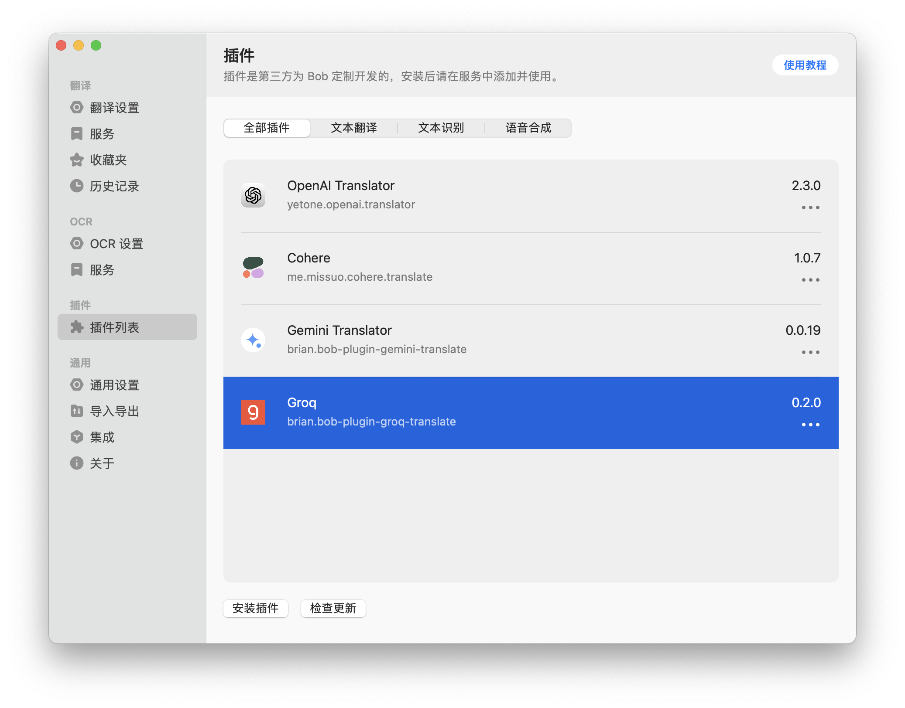
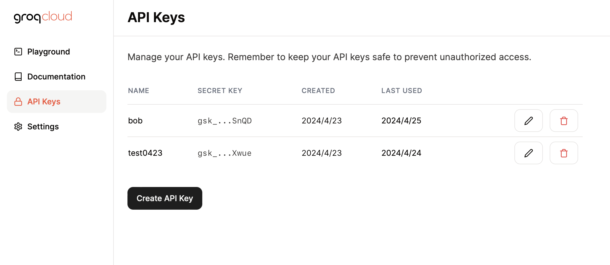
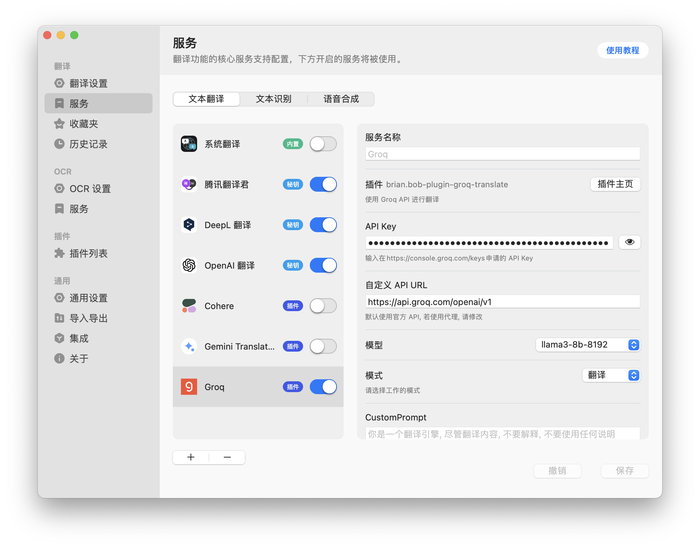

# Groq-translate-bob-plugin

基于 [Groq API](https://console.groq.com/keys) 的 Bob 翻译插件。

### 可选模型

* `gemma2-9b-it` ：更新支持, 谷歌最新开源, 2024 / 07 /07
* `llama-3.1-8b-instant` (默认)：兼具质量和速度
* `llama-3.1-70b-versatile`：效果更好，但速度不如`llama-3.1-8b-instant`
* `llama-3.1-405b-reasoning`: 效果最好，但速度最慢
* `mixtral-8x7b-32768`
* `gemma-7b-it`

## 使用

1. 下载安装此插件

	

2. 获取 [Groq API](https://console.groq.com/keys) 的 API KEY

3. 将 API KEY 填入 Bob 偏好设置 > 服务 > 此插件配置界面的 API KEY 的输入框中

## Notes

得益于`GroqCloud`本身巨快的推理速度，结合最新开源模型`llama3`，目前性价比超高（Groq API目前免费，但有速率限制，个人使用足够）。

## 感谢

本仓库参考部分其他优秀源码，感谢[bob-plugin-cohere](https://github.com/missuo/bob-plugin-cohere)、[bob-plugin-openai-translator](https://github.com/openai-translator/bob-plugin-openai-translator)。
